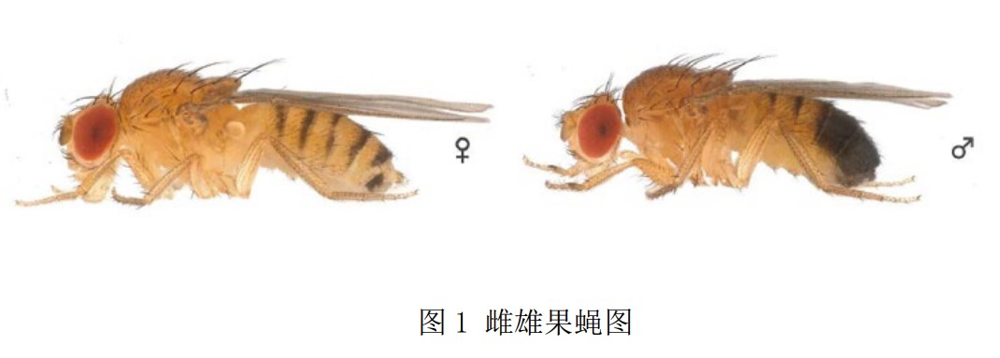
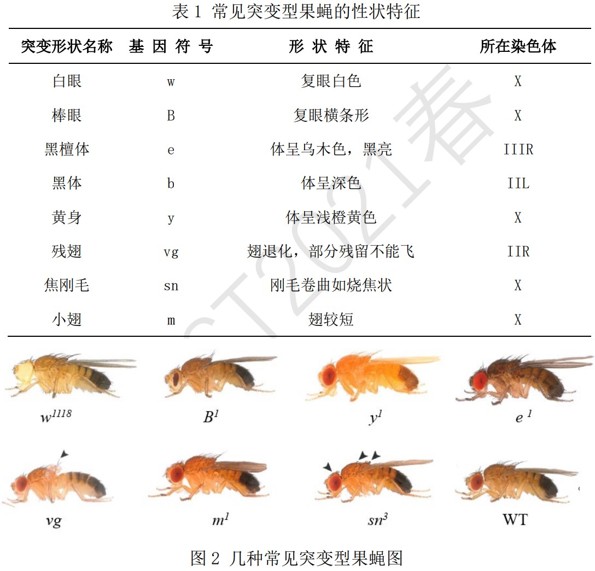
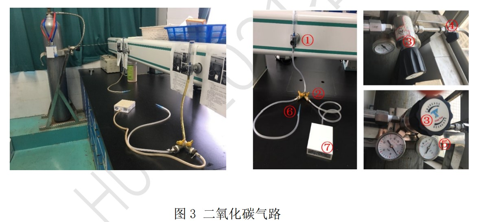
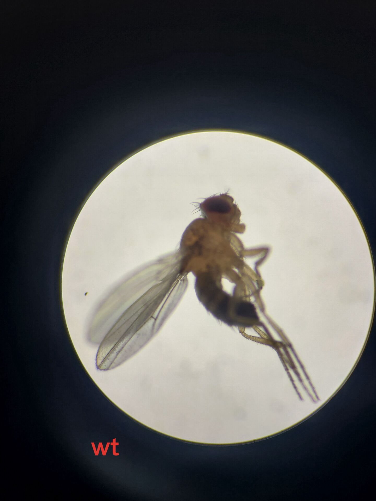
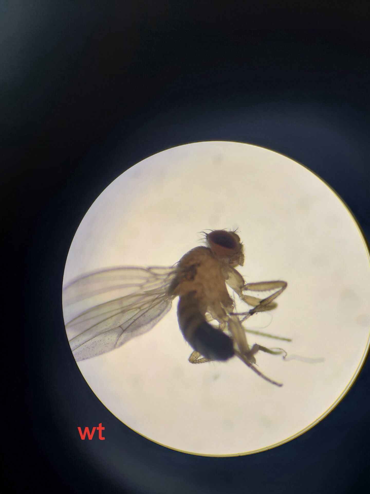
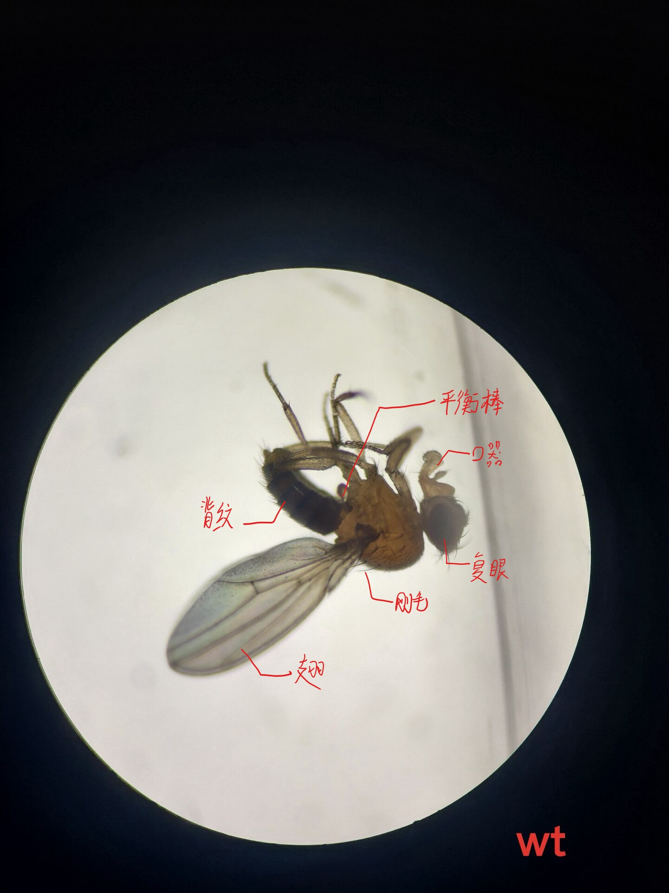
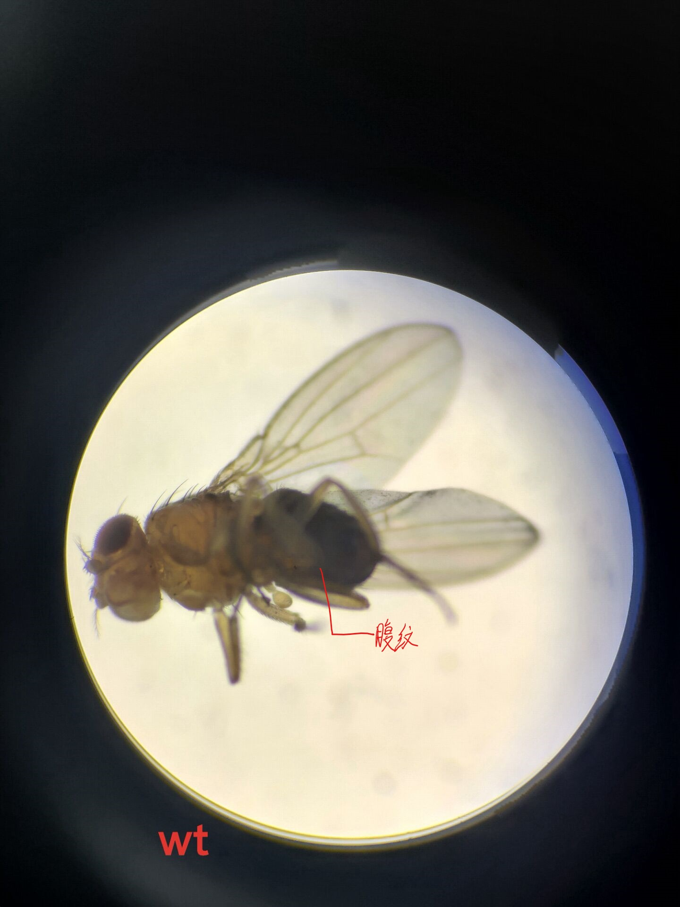
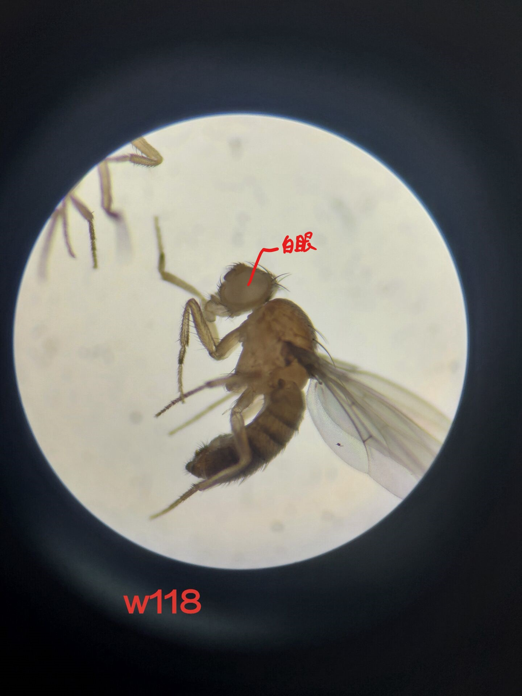
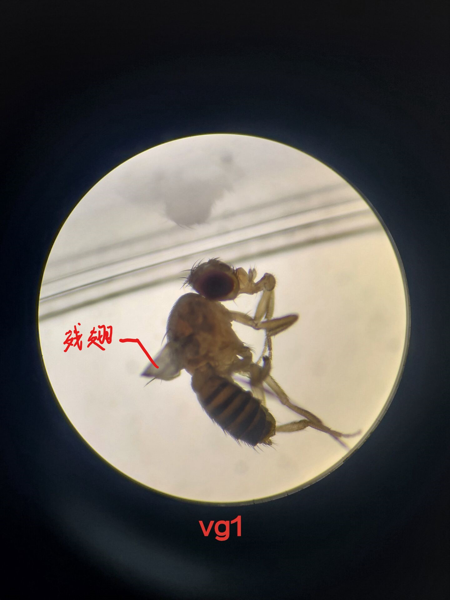

## 
 实验一 黑腹果蝇的培养与形态观察

###### 
--登峰1901 张皓鸿
#### 一、目的
1. 观察并掌握果蝇形态的基本特点，学会区分雌雄果蝇；
2. 了解果蝇生活史中各个不同发育阶段的形态特点；
2. 观察果蝇几种典型突变体的表型特征；
2. 掌握实验果蝇的饲养、管理、麻醉、转瓶、接种等基本实验技术。
#### 二、实验原理

&emsp;&emsp; 黑腹果蝇（Drosophila melanogaster）属于昆虫纲，双翅目，果蝇属。20 世纪初 Morgan 选择黑腹果蝇作为研究对象，不仅证实了孟德尔定律，而且发现了果蝇白眼突变的性连锁遗传，提出了基因在染色体上直线排列以及连锁交换定律，并因此于1933 年被授予诺贝尔奖，开创了利用果蝇作为模式生物的先河。20 世纪 80 年代以后针对果蝇的基因组操作取得重大进展，发展出一系列有效的实验技术，在发育的基因调控的研究、各类神经疾病的研究、帕金森氏病、老年痴呆症、药物成瘾和酒精中毒、衰老与长寿、学习记忆与某些认知行为的研究等方面均取得了突出成。2000 年，果蝇的全基因组测序基本完成，全基因组长约 165 Mb。 &emsp;&emsp;黑腹果蝇雌性体长 2.5 毫米, 雄性略小。自然情况下，黑腹果蝇幼虫的首要食物来源是使水果腐烂的微生物，如酵母和细菌，其次是含糖份的水果等。
* 果蝇的形态观察
    1. 身体各部分主要特征 
&emsp;&emsp;头部有一对复眼，三个单眼和一对触角；胸部有三对足，一对翅和一对平衡棒；腹部背面有黑色环纹，腹面有腹片，外生殖器在腹部末端，全身有许多体毛和刚毛。
    2. 成虫雌雄的鉴别 
&emsp;&emsp;雄性腹部有黑斑(black patch), 前肢有性梳(sexcombs)，而雌性没有,可以此来作区别雄性和雌性，如图1所示。

    3. 果蝇常见的几种突变性状特征，如表1和图2所示。

#### 三、实验器材
* 实验试剂：麦麸、蔗糖、丙酸、干酵母、琼脂、乙醚、二氧化碳等。
* 实验仪器：双目解剖镜、解剖针、培养瓶、毛笔、电陶炉、玻棒、搪瓷缸（500ml）等。
* 生物材料：WT及其它突变黑腹果蝇。

#### 四、实验过程

* 培养基的配制

配方一 玉米培养基 
A：蔗糖 6.2 g，加琼脂 0.62 g，再加水 38 ml。煮沸溶解。 
B：玉米粉 8.25 g，加水 38 ml，搅拌均匀，加热。 
&emsp;&emsp;A、B 混和加热成糊状后，冷却，50℃左右加 0.5 ml 丙酸，充分混匀后，再加0.7g酵母粉，搅拌均匀后，趁热分装至指型管中，每管约 2 cm 厚。待培养基冷却凝固后，用棉花吸干内管壁上的水分。每个瓶子准备一白色有空瓶塞，中间的小孔用棉花塞住。配制好的培养基进行高压灭菌，121℃，20min，或室温存放，待用。 
配方二 麦麸培养基 
A：蔗糖 15g，加琼脂 0.9g，再加水 60ml。煮沸溶解。 
B：麦麸 11g，加水 40ml，搅拌均匀。 
&emsp;&emsp;先 A 加热，待 A 中琼脂基本溶解后，倒入搅拌均匀的 B，混和加热至糊状，冷却至手背温感不太烫，加 0.67ml 丙酸，充分混匀后，再加 1.7g 干酵母粉，搅拌均匀后，趁热分装至指型管中，每管约 1cm 厚。待培养基冷却凝固、干燥后，用棉花/吸水纸吸干内管壁上的水分。每个瓶子用滤纸片或棉花团（棉塞）封口，配制好的培养基进行高压灭菌，121℃，20min，或室温存放，待用。
* 果蝇的麻醉 
二氧化碳麻醉法：
这个方法比较安全，对果蝇伤害较小，很少能将果蝇伤害致死，且操作易于掌握，是实验研究中最常用到的。
图 3 是本实验室二氧化碳麻醉法气路图。具体操作如下：

  1. 打开二氧化碳气路： 打开②的右侧开关（逆时针，使开关与阀平行）→打开①（顺时针）→打开④（顺时针约 90 度）→慢慢打开③（顺时针拧紧），同时观察⑤气压表数值是否上升及⑥处气嘴是否有气体出来→调整①及③的开关，使⑥处出来的气体恰当（①处小球在数值 1 处即可）。
  2. 取需麻醉的果蝇管，倒置，将气嘴⑥从下方插入管内，轻敲管壁，使麻醉的果蝇掉落于管口的滤纸上；
  3. 拔出气嘴⑥，将滤纸上的果蝇倒入新的果蝇管中，用滤纸封好管口，做好标记（时间，品种，日期，姓名），置于培养箱内培养；或将麻醉好的果蝇倒入倒在气盒⑦上，调整①处开关大小，确保气盒上的果蝇处于麻醉状态，将气盒⑦置于体视显微镜下，进行观察或挑选等实验操作。
* 果蝇的观察
1.果蝇生活史观察
用二氧化碳将果蝇麻痹，在气盒上挑选 3-5 对雌雄果蝇转入待用培养基中，
置于 25℃进行培养，根据其生长周期，隔一定时间观察其生长情况（见图 4）。
 图 4 25℃下果蝇生活史图
2.果蝇性状观察
将 WT 及其它突变型果蝇用乙醚麻醉致死后（果蝇翅膀外展 45 度角表示已死亡），置于体视显微镜下观察，区分各个不同品系果蝇之间性状的异同以及雌雄果蝇的异同。
* 果蝇的接种
将WT、W1118、残翅三种果蝇麻醉后，分别接入待用果蝇培养基中，每组各接两管，每管最好有 5 对果蝇。此两管将用于后续实验，请小心操作，不要混杂。
#### 五、实验结果及分析
1. 将麻醉后的野生型果蝇倒在滤纸上观察，分辨雌雄果蝇，填写下表

|性状|雌果蝇|雄果蝇|
|---|-----|-----|
|体型|较大|较小|
|性梳|无|有|
|腹末端|无黑斑|有黑斑|
|腹片|7节|5节|
|腹背面条纹|环纹5节|环纹7节|

&emsp;&emsp;&emsp;&emsp;&emsp;&emsp;&emsp;&emsp;雌&emsp;&emsp;&emsp;&emsp;&emsp;&emsp;&emsp;&emsp;&emsp;&emsp;&emsp;&emsp;&emsp;&emsp;雄

2. 以图片展示果蝇的平衡棒、翅、刚毛、腹节、背纹、复眼、口器、触角等特征        

果蝇特征

3. 观察突变体果蝇白眼（W1118）、残翅（vg）的表型特征，并将之与野生型相比较，以图片指出不同之处。

 野生型与突变型果蝇特征 

#### 六、思考题
1. 描述果蝇生活史及各个发育阶段的特征及时间。

&emsp;&emsp;果蝇的生活周期长短与温度关系很密切。30℃以上的温度能使果蝇不育和死亡，低温则使它的生活周期延长，同时生活力也降低，果蝇培养的最适温度为 20-25℃。
幼虫->成虫|57 days|18 days|6.3 days|4.2 days|

|   |10°C|15°C|20°C|25°C|
|---|---|---|---|---|
卵->幼虫|---|---|8 days|5 days|
幼虫->成虫|57 days|18 days|6.3 days|4.2 days|

从表 2 中可以看出，25℃时，从卵到成虫约 10 天；在 25℃时成虫约活 15天。 
&emsp;&emsp;卵：羽化后的雌蝇一般在 12 小时后开始交配，两天后才能产卵。卵长 0.5mm，为椭圆形，腹面稍扁平，在背面的前断伸出一对触丝，它能使卵附着在食物(或瓶壁)上，不致深陷到食物中去。 
&emsp;&emsp;幼虫：从卵孵化出来后，经过两次蜕皮，发育成三龄幼虫，此时体长可达 4-5mm。肉眼可见其前端稍尖部分为头部，上有一黑色斑点即为口器。口器后面有一对透明的唾液腺，透过体壁可见到一对生殖腺位于躯体后半部上方的两侧，精巢较大，外观上是一明显的黑点，而卵巢则较小，可以此作为鉴别。幼虫活动力强而贪食，它们在培养基上爬行时，留下很多条沟，沟多而且宽时，表明幼虫生长良好。 
&emsp;&emsp;蛹：幼虫生活 7-8 天准备化蛹，化蛹前从培养基上爬出，附着在瓶壁上，逐渐形成一梭形的蛹.在蛹前部有两个呼吸孔，后部有尾芽，起初蛹壳颜色淡黄而柔软，以后逐渐硬化，变为深褐色，表明即将羽化了。 
&emsp;&emsp;成虫：幼虫在蛹壳内完成成虫体型和器官的分化，最后从蛹壳前端爬出。刚从蛹壳里羽化出来的果蝇虫体比较长，翅膀尚未展开，体表尚未完全几丁质化，故呈半透明的乳白色。透过腹部体壁，可以看到黑色的消化系统。不久，变为短粗圆形，双翅展开。体色加深。如野生型初为浅灰色，然后呈灰褐色。

2. 请举一例说明果蝇作为模式生物在生物学研究领域的应用。

&emsp;&emsp;20世纪70年代克里斯汀·纽斯林-沃尔哈德（Christiane Nüsslein-Volhard）开始研究果蝇的发育基因。她从中得知，卵细胞中的四个基因决定了或是监控了受精卵的发育。1980年她发表了论文“影响黑腹果蝇体节数目和极性的变异”，她也因此获得了1995年的诺贝尔医学奖。
