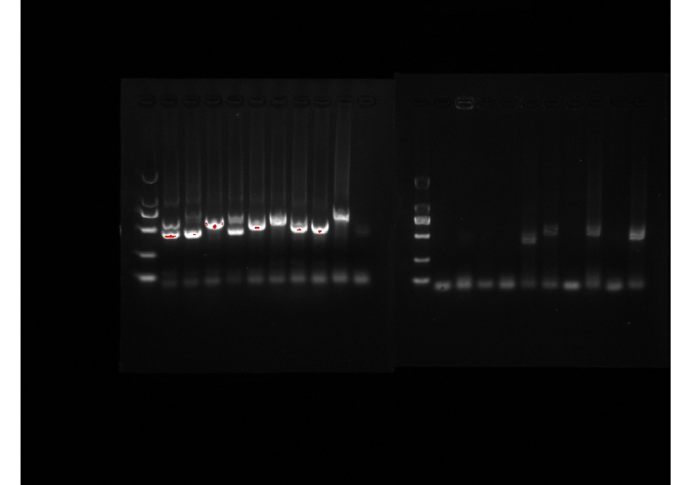

### <center>实验三DNA指纹技术

###### <p align="Right">--登峰1901张皓鸿 </p>
#### 一、实验原理：
* DNA指纹是指利用个体间DNA差异来进行与传统指纹分析相似的身份识别。DNA指纹是以DNA的多态性为基础，而卫星DNA的发现则是其最重要的奠基石。

* 卫星DNA是分子遗传标记的一种，它是由一短序列（即重复单位或核心序列）多次重复而成，因此也有人称其为可变数目串联重复序列（variablenumbersoftandemreprat，VNTR）。在人类基因组中存在多种由不同重复单位组成的卫星DNA，重复单位的碱基序列在不同个
体中具有高度的保守性，而卫星DNA的多态性则来源于重复单位的重复次数不同，并形成了众多的等位基因。例如，人类1号染色体上的VNTRD1S80，核心序列由16个核苷酸组成，拷贝数在14～44个之间，已知有29种不同的等位基因（其中一个等位基因序列如下）。
```
001gaaactggcctccaaacactgcccgccgtccacggccggccggtcctgcgtgtgaatgac
061tcaggagcgtattccccacgcgccagcactgcattcagataagcgctggctcagtgtcag
121cccaaggaagacagaccacaggcaaggaggaccaccggaaaggaagaccaccggaaagga
181agaccaccggaaaggaagaccacaggcaaggaggaccaccggaaaggaagaccaccggca
241aggaggaccaccggcaaggaggaccaccaggaaggaggaccaccagcaaggaggaccacc
301agcaaggaggaccaccaggaaggaggaccaccaggaaggaggaccaccggcaaggaggac
361caccaggaaggaggaccaccaggaaggaggaccaccggcaaggaggaccaccaggaagga
421gaaccaccaggaaggaggaccaccaggaaggaggaccaccaggaaggaggaccactggca
481aggaagaccaccggcaagcctgcaaggggcacgtgcatctccaacaagac
```
* DNA指纹图谱的基本特点：
    * 多位点性：基因组中某些位点的小卫星重复单位含有相同或相似的核心序列。在一定的
杂交条件下，一个小卫星探针可以同时与十几个甚至几十个小卫星位点上的等位基因杂交。
高变异性：DNA指纹图谱反应的是多个位点上的等位基因的特征，具有很高的变异性。
发现两个无血缘关系个体具有相同DNA指纹图谱的概率仅为5×10-19，因此，除了同卵双
胞胎，几乎不可能有两个人的DNA指纹图谱完全相同。
    * 稳定的遗传性：DNA指纹图谱中的谱带能够稳定遗传，杂合带遵守孟德尔遗传规律。
子代DNA指纹图谱中产生与双亲都不同的新带的概率（基因突变）仅在0.001～0.004之间。DNA指纹图谱还具有体细胞稳定性，即用同一个体的不同组织如血液、肌肉、毛发、精液等的DNA作出的DNA指纹图谱是一致的。

* 本次实验所选择的方法是利用PCR扩增卫星DNA，再通过电泳显示其多态性，这是目
前DNA指纹图谱分析的常用方法。
* 本实验将以20个不同人基因组DNA样品以及用痕量提取方法提取的本人基因组DNA
为模板扩增D1S80基因座，初步认识及学会DNA指纹技术的实验及分析方法。人群中D1S80
座位的杂合率约为86％，从理论上讲，可能存在435种不同的等位基因组合。利用D1S80座位两侧序列设计的引物（Kasaietal，1990），通过PCR反应，很容易确定特定个体的D1S80
等位基因构成，纯合体只有一条DNA带，而杂合体有两条不同的DNA带。由于D1S80的
核心序列较长，为16bp，因此，可以用较高浓度的琼脂糖电泳将不同等位基因区分开来。

#### 二、实验目的：
1. 学会 DNA 指纹分析常规方法。
2. 掌握痕量法提取基因组 DNA 的方法。
3. 学习/复习 PCR 的基本操作。
4. 复习琼脂糖电泳的基本操作。

#### 三、实验器材：
* 实验仪器:
口腔拭子，纯净水，一次性杯子，微量移液器（三种规格），小型掌上离心机，高速离心机，恒温水浴锅，浮子（可放 1.5ml 离心管）、漩涡振荡器，恒温仪、PCR 仪，PCR 板、冰
盒、制冰机、1.5ml 离心管托板、电泳仪，电泳槽（11 孔梳子），凝胶成像仪，废物杯等。枪头（三种规格），1.5mL，0.2 mL 离心管，使用前均需 121℃高温灭菌。

* 实验试剂:琼脂糖，1×TAE，GelRed、上样缓冲液（10×），Proteinase K（2mg/ml），DNA 相对分子质量标记 DL2000，5% Chelex 100 树脂，Taq 酶（5U），PCR Buffer（10×），dNTP（10mM），
D1S80 正反向引物工作液（10uM），2×PCR Premix，无菌水等。
* 实验材料:本人的口腔上皮细胞、20+个个体基因组 DNA。

#### 四、实验过程：
1. 痕量法提取口腔上皮细胞基因组 DNA 样本
    1. 取口腔上皮细胞：
先漱口，然后用灭菌的口腔拭子充分擦刮口腔内壁，将该拭子放入 1.5mL 装有 1mL 无
菌水的小离心管中，使粘附在口腔拭子表面的口腔细胞悬浮其中（以能看到悬浮物为好）。
此步可重复 1-2 次。震荡 10s 左右，12000 r/min 离心 1min（注意平衡！）。

    2. 去除上清：
从离心管中吸出上清液（或倒出上清液）并丢入废物杯中。注意不要吸到沉淀！

    3. 去除杂质：
向离心管中加入 200μL 5% Chelex 100（5％ Chelex-100 为悬浊液，使用前要充分振摇，
使 Chelex-100 颗粒悬浮），震荡 10s 左右混匀。Chelex 100 是一种化学整合树脂，由苯乙烯、
二乙烯苯共聚体组成，具有较强的结合二价离子等杂质的作用，并能防止 DNA 的降解。

    4. 酶解蛋白：
加入蛋白酶 K 至终浓度为 0.02mg/ml，混匀，56℃保温 30min 左右。

    5. 终止反应：
剧烈震荡 10s，沸水浴 8min。

    6. 得到模板：
12000r/min 离心 3min，离心管中溶液分成上下两层：下层为 Chelex100 和细胞碎片的沉
淀，上层溶液含 DNA 分子，可以直接用作 PCR 模板。
此 DNA 样本可在 4℃或-20℃保存，必要时可在使用前再次加热并离心，使管内物质分
层。

2. PCR 扩增 D1S80 等位基因
    1. 选择需分析的样本。（5-10 个样本）
    2. 每个人用记号笔在 0.2mL PCR 管上做好标记。（多少个反应？）

    3. 根据 PCR 体系设计基本原则，设计 PCR 反应体系

    4. 准备冰盒，开始反应前尽量使 PCR 管保持在冰上。按照所设计的体系，依次加入各个成分（考虑加样顺序！！！）。

    5. 轻弹管壁，混匀溶液。在掌上离心机中离心 10s，使管壁上的液滴落下。

    6. 进行PCR反应

    7. 将扩增好的 PCR 产物暂时放置于-80℃，直至开始电泳。

3. D1S80 等位基因 PCR 扩增产物的琼脂糖电泳鉴定。
    1. 用 1×TAE 电泳缓冲液配制适当体积、一定浓度的琼脂糖凝胶。

    2. 待凝胶溶液冷却至 60℃左右时，按比例加入 10000×Gelred 染料，混合均匀。

    3. 将凝胶倒入电泳制胶槽内，插入合适的梳子。

    4. 将凝固好的凝胶放入电泳槽内，倒入 1×TAE 电泳缓冲液至凝胶完全没入液体中，小心拔去梳子，注意不要破坏梳孔。

    5. 将 PCR 产物（20-30ul）按照一定比例与上样缓冲液混合均匀。

    6. 按照一定顺序将 DNA 相对分子质量标记（5-10ul）以及混合好的 PCR 扩增产物加入已经凝固的凝胶样孔，注意不要有气泡进入。

    7. 连接电泳槽与电泳电源，打开电泳电源，调节电压，60V-100V，电泳 30min-50min 左右（注意观察溴酚蓝条带）。

    8. 用紫外分析仪观察凝胶，记录每个个体的 DNA 条带数目及其位置。


#### 五、实验结果及分析：
1. 根据实际实验数据，分析PCR结果
    * PCR反应体系

    |PCR成分|实验组μl|Premix对照组μl|
    |------|-----|---------|
    |模板|3|4.5|
    |引物R|0.5|0.75|
    |引物F|0.5|0.75|
    |dNTP|0.5|premix 15|
    |taq酶|0.5|premix 15|
    |$ddH_2O$|22|9|
    |10XBuffer|3|premix 15|
    |total|30|30|
    * PCR反应程序

    |步骤|温度|时间|备注|
    |---|---|---|---|
    |1|94℃|1min|无|
    |2|94℃|15s|步骤2，3，4做15个循环|
    |3|65℃|15s|步骤2，3，4做15个循环|
    |4|72℃|15s|步骤2，3，4做15个循环|
    |5|72℃|10min|无|
    |6|15℃|∞|无|
    * 凝胶电泳结果
    

    * 根据结果，所选样品中无罪犯

2.

<br>
<br>
<br>
<br>
<br>
<br>
<br>


|编号|是否杂合|条带大小|编号|是否杂合|条带大小|
|---|-------|-------|---|-------|-------|
|1|无法分辨|800|13|是|700
|2|是|600|14|是|750
|3|是|600|15|是|750
|4|是|600|16|是|600
|5|否|750|17|是|750
|6|否|800|18|是|750
|7|是|600|19|是|600
|8|是|750|20|是|800
|9|否|800|21|是|600
|10|是|900|22|是|750
|11|是|800|23|是|700
|12|否|750|24|否|800

杂合率为 $\frac{23-5}{23}=78.26\%$

以第一条为例，$重复数=\frac{1+（800-161）}{16}=40$
#### 六、思考题
* DNA做亲子鉴定，目标不是编码序列（当然也就不是基因），而是微卫星体（microsatellites）。微卫星体属于非编码序列，不参与蛋白质编码。但每个微卫星体都是由十几二十个字母构成的核心序列重复很多次而形成，在基因组里面有一千多处，重复次数处处不一样，人人不一样，就像条码一样。因此每个人的微卫星体条码都是独特的，这点可以用来做身份认定，而由于你的微卫星体统计上一半来自于父亲或母亲，因此微卫星体相似度又是和血缘关系线性相关的，这点可以用来做亲子和血缘关系鉴定。

* 其突出优点就是技术相对简单。基本步骤是用设计好的引物PCR扩增微卫星体DNA，再用限制性内切酶切齐，然后电泳分析。由于不同碱基的核苷酸序列电泳速度有细微区别，因此电泳就会跑出一张特征图谱，图谱比较就能得到统计上相当精确的微卫星体相似度、相关度。
