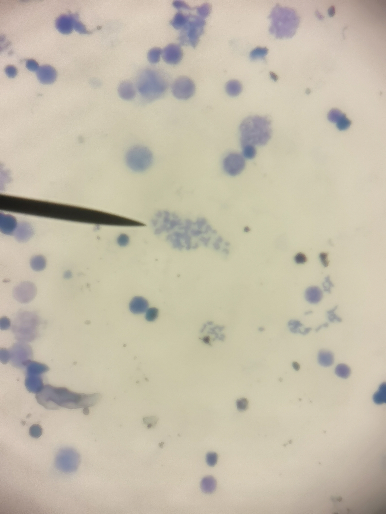
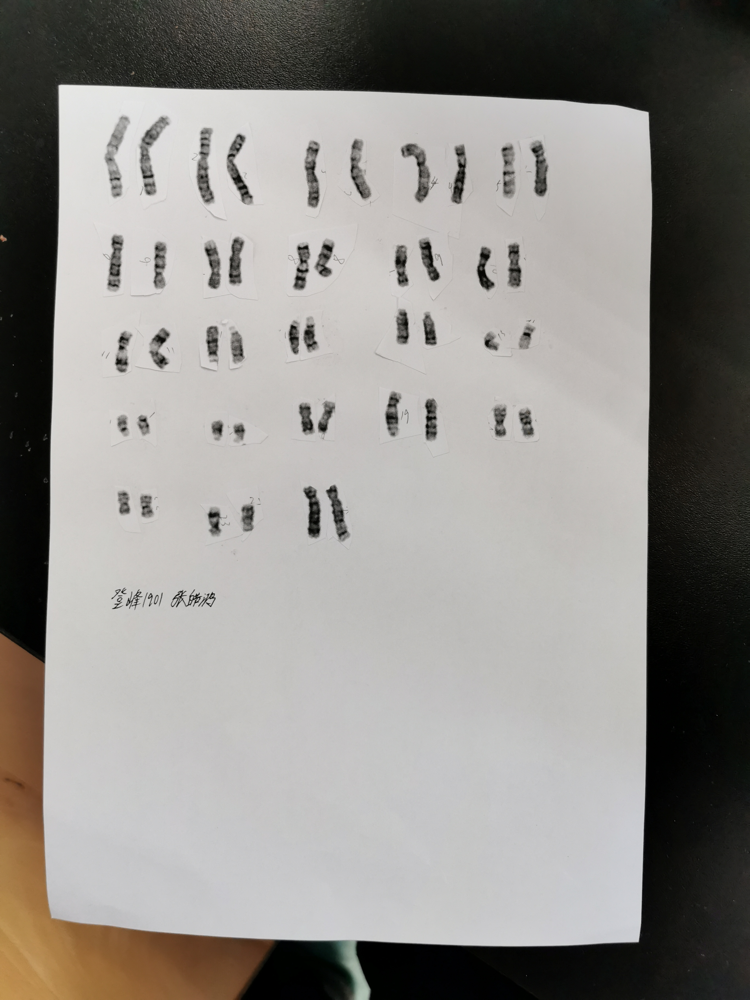

### 
小鼠骨髓细胞染色体标本的制备

###### 
--登峰1901张皓鸿 

#### 一、实验原理
* 染色体的形态结构在细胞增殖周期中是不断地运动变化的，一般在有丝分裂中期，染色体的形态最典型、最易辨认和区分。因此，制备染色体标本获取的是中期细胞。用适量的秋水仙素溶液注入动物腹腔内，可以阻止分裂细胞纺锤丝的形成，从而积累大量处于分裂中期的细胞。对于小型动物的染色体制片最好最有效的材料就是骨髓组织。骨髓细胞中，有丝分裂指数相当高，因此可以直接得到中期细胞而不必象淋巴细胞或其它组织那样要经过体外培养。 只要通过常规的制片方法，即可得到大量可供分析的染色体标本。本方法简便、可靠，不需要经体外培养和无菌操作。
* 染色体显带技术是借助特殊的处理程序,使染色体的一定部位显示出深浅不同的染色体带纹的技术。这些带纹具有物种及染色体的特异性,可更有效地鉴别染色体和研究染色体的结构和功能。常见有G带、Q带、C带、N带等。本实验使用G带技术。G带即吉姆萨带，是将处于分裂中期的细胞经胰酶或碱、热、尿素等处理后，再经吉姆萨染料染色后所呈现的区带，是目前被广泛应用的一种带型。其特性是显带方法简单恒定，带型稳定，保存时间长。一般认为，易着色的阳性带为含有AT多的染色体节段，在间期核呈固缩状态，而且是DNA晚复制区之一，有相当一部分中度重复序列DNA可能在G带区；相反，含GC多的染色体段则不易着色。也有人认为，Giemsa染料在G带区是与DNA结合，而且与结合DNA的染色质非组蛋白有关。总的来说，G显带的机制还未搞清。目前，染色体显带技术已广泛应用于染色体疾病及癌症方面的研究，用来诊断多种疾病及研究某些癌症的病因、疗效及预后等。
* 染色体核型：指一个物种所特有的染色体数目和每一条染色体的形态特征。小鼠体细胞中共有 20 对染色体，19 对常染色体，1 对性染色体。核型分析：将待测细胞的核型进行染色体数目、形态特征分析的过程称核型分析。
* 核型模式图：是指将一个染色体组的全部染色体逐个按其特征绘制下来，再按长短、形态等特征排列起来的图像。核型分析均是以中期染色体为标准，对制作出的染色体标本进行照相以获得染色体的显微图像，并将其剪裁排列即成，或用专用软件进行分析排列。凡处于活跃增殖状态的细胞，或者经过各种处理后，细胞就可进入分裂期此时均可用于染色体分析。
* 本实验拟用常规低渗法从经秋水仙素处理的小鼠骨髓细胞中得到小鼠染色体组，再用G带染色进行染色体显带、分析。
#### 二、实验目的
* 掌握小鼠骨髓细胞染色体标本的制备方法。
* 掌握染色体 G 带显色技术。
* 掌握染色体分组特征, 对染色体核型进行分析。
* 了解并制备小鼠染色体核型图。
#### 三、实验试剂与器材
* 实验材料：实验用清洁级小鼠20g左右。
* 实验试剂：200µg/ml秋水仙素、生理盐水（0.9%NaCl）、0.075M KCl低渗液、Carnoy固定液（甲醇：冰乙酸=3：1）、Giemsa染液、0.025mol/L胰酶溶液
* 实验用具：眼科剪、眼科镊、吸水纸、纱布、1ml注射器、 10ml离心管、低速离心机、恒温水浴锅、吸管、病理级载玻片、染色架、染色缸、废液缸、显微镜。
#### 四、实验过程
1. **术前3～4h腹腔注射秋水仙素**
* 按2～4μg/ (g·bw)的剂量腹腔注射秋水仙素，3～4h后颈椎脱臼法处死。
2. **取四肢股骨**
* 取出小鼠四肢的股骨（两个后肢也可），剔除附着的肌肉并用纱布擦净。
3. **收集细胞**
* 用解剖剪剪去股骨两头，用一次性注射器吸取37ºC预热的生理盐水冲洗股骨髓于离心管中，反复数次，至骨髓发白，1000r/min离心10 min，弃上清。
4. **低渗处理**
* 将约7ml预热37ºC的低渗液加入离心管中，用吸管轻轻混匀，再置于37ºC 恒温水浴锅中保温15-20min(中途用吸管混匀一次)。
5. **预固定**
* 取出离心管，向管底加入1ml新配制的Carnoy固定液(甲醇：冰乙酸=3：1)，用吸管混匀后，在37ºC恒温水浴锅中保温10min，以1000 r/min离心10 min，弃上清。 
6. **固定**
* 向沉淀物中加入新鲜Carnoy固定液5ml，用吸管轻轻吹打均匀，37ºC恒温水浴锅中再保温10min，平衡后1000 r/min离心10 min。
7. **制备细胞悬液**
* 小心弃掉上清，避免将细胞沉淀悬起。最后留大约0.2-0.3ml的上清液，用吸管吹打成
细胞悬液。
8. **滴片**
* 从冰箱中取出充分预冷的洁净的载玻片，将其倾斜30º，取少许细胞悬液于玻片上30-40
厘米的高度滴片，每片滴2-3滴(不要重叠)。滴片后用口轻轻将玻片上的液体轻轻吹散，并在酒精灯火焰过几下。 
9. **老化**
* 将上述小鼠染色体标本白片在室温下存放5-7天。
10. **消化**
* 将老化5-7天的染色体标本用37ºC恒温水浴20min的0.025 mol/L 胰酶溶液在37ºC下处
理30-60秒，用流水冲洗。
11. **染色**
* 2% Gimesa染液(pH7.0)染色30min后，用水冲洗。本实验使用扣染的方法进行染色。
12. **镜检**
* 先用低倍镜找到一好的分裂相区域，然后转用高倍镜或油镜进行详细的观察。
小鼠骨髓细胞染色体观察
    * 小鼠骨髓细胞染色体计数：选择20个染色体形态较典型、分散较好的分裂相计数小鼠骨髓细胞的染色体数。
    * 小鼠染色体形态的观察：小鼠的染色体呈“U”形，全部为端部着丝粒染色体。可配成20对，分成4组，其中一对为性染色体。X染色体大小在5~6号之间，Y染色体最小。
    * 
* 在显微镜下，可见分布在小鼠染色体全长上的宽窄不同的相间条带。带纹的多少随染色体的不同而异，另外还同染色体所处的时期不同而有差异，一般中期染色体带纹较少，早中期与晚前期染色体的带纹较多，前期染色体多呈颗粒状。
13. **核型分析**
* 由于小鼠骨髓染色体较小，不易进行核型分析。本实验用G带染色的人染色体进行核型
分析的练习。

#### 五、实验结果及分析
* 低倍镜下各种状态骨髓细胞图与分散的小鼠骨髓细胞染色体图

* 核型分析后的人染色体图

* 小鼠骨髓染色体计数
     * $染色体数=2*观察到的成对染色体对数=40$
* 对染色体片子质量进行分析
    * 找到的染色体有明显分散，但细胞密度较低，可能由于冲洗次数过少。
#### 六、思考题
* 写出下列试剂有何作用
    * 秋水仙素：可以阻值分裂细胞纺锤丝形成，从而积累大量处于分裂中期的细胞。
    * 低渗液：使细胞吸水膨胀，在滴片时细胞破裂使染色体暴露出来。
    * Carnoy固定液：固定染色体形态。
    * 0.025mol/L胰酶溶液：消化细胞内的但报纸，使染色体观察更清楚。
    * 2%Gimesa染液：对染色体进行染色。
* 核型分析有何意义
    * 染色体核型分析可以诊断由于染色体异常引起的遗传病、研究亲缘关系、探讨物种进化等。核型分析可以为细胞遗传分类、物种间亲缘的关系以及染色体数目和结构变异的研究提供重要依据。