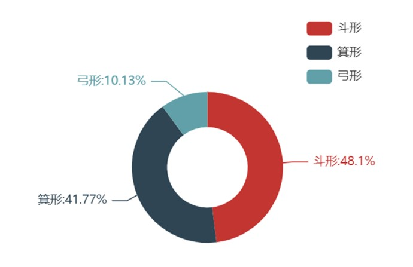
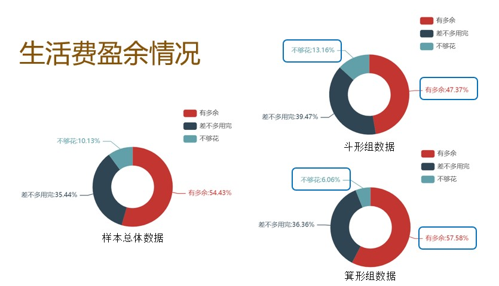

### 
人体皮纹遗传学分析

###### 
--登峰1901张皓鸿 

#### 一、实验原理
* 人体的皮纹属于多基因遗传，即在出生前就已经定型，终身不变，具有个体的特异性。人体皮纹与人体的身体能力有一定相关性。本次实验利用问卷星，Excel，R等软件工具，对人体皮纹和消费观数据进行收集，统计和分析，寻找其间的相关性。
#### 二、实验目的
* 试图发现指纹与消费观或者说消费习惯有没有一定联系，以此思考是否可以通过指纹推测是否需要注意或关注消费习惯的培养。
#### 三、实验器材：
* 问卷星：数据收集
* python：数据整理与可视化
* R：数据分析
#### 四、实验过程：
* 本次调研主要是通过问卷星进行调研，通过一周的时间分发问卷，我们回收问卷162份其中有效158份，关于问卷是否有效，是通过问卷中后与末尾两道常识题来判断，这两题选项设为随机，如果这两题答错即试问问卷无效，不计入统计。
* 由于每个人有十个指纹，数量较多，不便于统计分析，于是我们选择按每个人各指纹类型出现的频率对样本进行的分类，十个指纹中斗形最多的划为斗形组，箕形最多的为箕形组，弓形最多的为弓形组。以下为分类后样本指纹类型占比，可以发现弓形指纹占比明显较少，且对其数据的初步分析发现，由于样本较少，偶然性较大，其数据与样本总体均值偏离较大，于是，我们在进一步分析时选择放弃弓形指纹，而着重比较斗形与箕形组之间的差异。
#### 五、实验结果及分析：
1. 小组分工情况

  |课题题目|指纹与消费观|
  |-------|-----------|
  |课题内容描述|指纹与消费观或者消费习惯之间的关系|
  |拟调查人群|在校大学生|
  |拟采用的调查方法|问卷星问卷|
  |拟采用的取样方法|随机取样|
  |拟取样的数量|150人|
  |小组成员与分工|汇报人：刘心敏 组员：张皓鸿、林昱、杨涵韬、谢诗雨|
2. 将收集到的样本原始数据进行汇总
    * 有效问卷158份，其中各种指纹所占比例如下：
    
3. 对收集到的有效样本运用图、表等进行统计，并针对所研究课题及相关文献进行分析，得出恰当的结论。
    * 利用pyecharts对收集到的数据进行可视化，由图表可以得出：
        * 箕形指纹的人在消费时更有计划，更理智，有更多的人盈余较多。
        
        * 箕形组对目前消费很满意的比例也远远高于斗形组，且不满意的比例也更小；而斗形组似乎有很大一部分的人并不太不关注自己目前的消费状况
        
        * 箕形组有更大比例的人选择实现做好计划再花钱，合理安排好自己的生活费开销
        
        * 箕形组也有更多的人期望着每个月有可以供自己支配的盈余
         
        * 箕形组的有更多比例的人并不需要使用预支付
         
        * 箕形组有更多比例的人并未在游戏中花钱，氪金数目也较小。
         
        * 再由lasso回归筛选与指纹最为相关的消费特征，其结果与上述特征大部分吻合，映证了上面得出的结论。
        
#### 六、思考题
* 皮肤纹理分析有何遗传学意义?
    * 人体的皮纹属于多基因遗传，即在出生前就已经定型，终身不变，具有个体的特异性。
    * 人体的掌长，掌纹可以在一定与上体现个体的身高等性状相关。
    * 研究发现，皮纹的异常与某些遗传性疾病，尤其是染色体病有较高的相关性。因此，皮纹可用于某些遗传病的辅助诊断。

