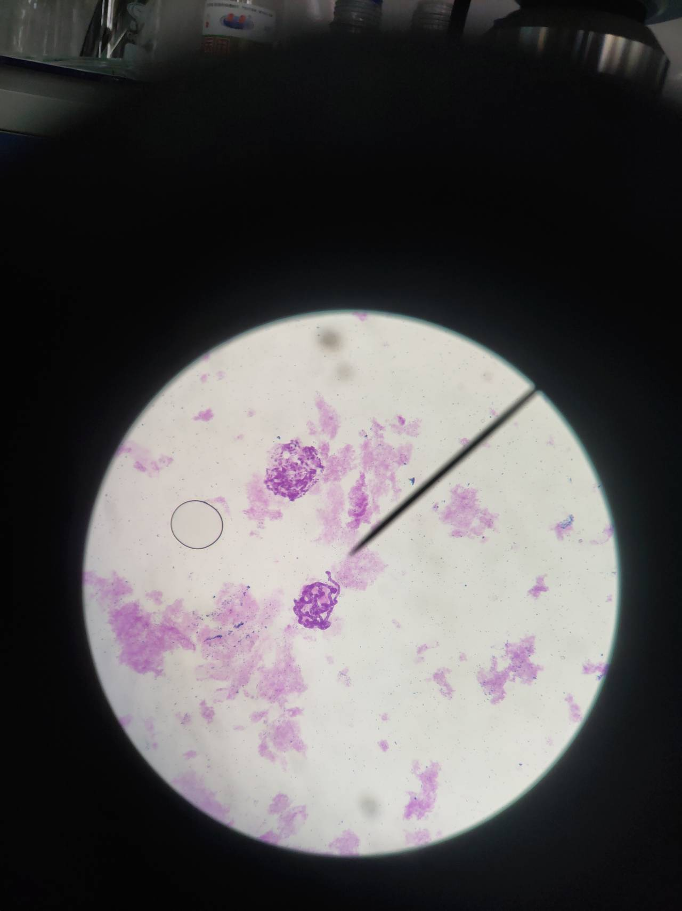

### 
果蝇唾液腺染色体制作与观察

###### 
--登峰1901张皓鸿 

#### 一、实验原理：
* 双翅目昆虫，如果蝇、摇蚊幼虫唾液腺中的染色体是一类巨大染色体，双翅目昆虫的消化道细胞发育到一定阶段之后就不再进行有丝分裂，而永久停留在分裂间期。但随着幼虫的
生长，唾液腺染色体仍不断地进行自我复制而且不分开，经过多次的复制形成约1000～4000拷贝的染色体丝，合起来直径达 5μm，长度达400μm，比普通细胞中期染色体大约 100～150 倍，所以称为多线染色体或者巨大染色体。
* 唾液腺染色体的另外一个特点是体细胞中同源染色体处于紧密配对状态，这种状态称为“体细胞联会”。在以后不断的复制中仍不分开，由此成千上万核蛋白纤维丝结合在一起，紧密盘绕。所以细胞中染色体只呈单倍数。黑腹果蝇的染色体数目 2n＝8，其中第II、第III染色体为中部着丝粒染色体，第IV和第I（X染色体）染色体为端着丝粒染色体。唾液腺染色体形成时，染色体着丝粒和近着丝粒的异染色质区聚于一起形成一个染色体中心，所以在光学显微镜下可见染色中心伸出6条配对的染色体臂，其中5条为长臂1条为紧靠染色体中心的很短的臂。
* 唾液腺染色体经染色后，呈现颜色深浅不同、疏密各异的横纹。这些横纹的数目、位置、
宽窄及排列顺序都具有物种的特异性。研究认为这些横纹与染色体的基因是有一定关系的。从其横纹分布特征可对物种的进化特征进行比较，而一旦染色体上发生了缺失、重复、倒位、易位等结构变化，也可较容易地在唾腺染色体上观察识别出来。
* 一般在一个唾腺细胞中能看到 5 条长臂的染色体， 分别为 X 染色体、第二对染色体的左臂（L）、右臂（R）、第三对染色体的左臂（L）、右臂（R），这 5 条染色体臂由染色中心发射出来。这是由于第四对染色体相当小看不清，Y 染色体浓缩，X 染色体的着丝点位于端部只有一条臂之故。

#### 二、实验目的：
* 掌握唾液腺染色体的制片技术。
* 了解体细胞染色体联会现象，观察果蝇唾液腺染色体的特点，学会分辨各条染色体。
* 了解果蝇唾腺染色体在遗传学研究中的意义。

#### 三、实验试剂与器材：
果蝇三龄幼虫、果蝇生理盐水（0.75%NaCl）、1N HCl、蒸馏水、石炭酸品=红、体视显微镜、显微镜、解剖针、滤纸条、生理级载玻片、生理级盖玻片

#### 四、实验过程：
##### 1. 剥离果蝇幼虫的唾液腺
取一洁净的载玻片，滴上 1 滴果蝇生理盐水（0.75%NaCl）。在瓶壁上挑选肥大的、充分发育的、活跃的、三龄幼虫（最好为雌性）放在的生理盐水中。果蝇唾液腺位于幼虫食道的两侧，长度约占身体总长的1/3-1/4左右。解剖时把载玻片放在解剖镜或放大镜下，一手用解剖针压住头部(外型似一个黑色小点)，压住的地方越小越好，同时，用镊子夹住幼虫身体 1/2 处， 轻轻地将幼虫的头部自身体拉开，唾液腺随同内脏一起拉出。如果头部拉断，腺体没有拉出，可以用解剖针从镊子附近的腹部缓缓地向头端挤压，也可压出唾液腺。也可以直接用压住头部的解剖针将其头部切开，使果蝇头部内部组织涌出。然后在镜下细心分离，理出双叉形、半透明的囊状腺体即为唾液腺，在生理盐水中无论怎样触动它都不会发生形状改变。在显微镜下观察，由单层细胞构成，细胞形状不规则，细胞轮廓清晰，细胞大，细胞核也大，甚至可以看清细胞核是由染色体卷缩在一起形成的。唾液腺拉出后，剔除腺体周围乳白色的脂肪组织和身体的残留部分，只留唾液腺在载玻片上。
##### 2. 固定与解离
用滤纸条吸净唾液腺周围的其它物质，然后在唾液腺上滴一滴 1N HCl，作用0.5~3分
钟，使染色体固定，同时使组织松软，利于细胞破裂，使染色体散开。
##### 3. 水洗与低渗
用蒸馏水洗1~3次（或 0.75%的生理盐水），水洗时要注意不要把唾液腺弄丢，水洗要彻底，目的是洗去酸液，以免影响染色效果。另外水洗过程也是细胞低渗过程，使唾液腺细胞膨胀。
##### 4. 染色
水洗后，用滤纸条将唾液腺周围液体吸净（尽量去除水分），然后在唾液腺上滴一滴石炭酸品红，染色15~40分钟，如果气温太低，可把载玻片放在酒精灯上来回移动加温（不可煮沸），以加速染色。
##### 5. 压片
用滤纸条吸干染色液后，在材料上再滴一滴石炭酸品红，盖上盖玻片，用解剖针垂直轻敲盖玻片中间，不能移动盖玻片，然后，以螺旋形由中间向外轻轻敲击盖玻片，使细胞分散，染色体展开；最后用两层滤纸盖上盖玻片，垂直按压，同时吸取溢出的染液。压片时注意不能移动盖玻片。
##### 6. 显微镜观察
先用低倍镜观察，找到分散好的染色体图像后换高倍物镜观察。 果蝇的体细胞染色体臂上有明显深浅不同、宽窄不同、粗细也不同的带纹，各个染色体臂端部的带纹特征不同，可以据此区分染色体，在染色体臂的不同部位有时会出现疏松区（胀泡），这是转录活性区。

#### 五、实验结果及分析：
观察到的唾液腺染色体如下

染色体并未完全散开，可能由于压片不完全。且染色过深，无法清晰辨别横纹。右上伸出的一条可能为X染色体。

#### 六、思考题：
* 果蝇唾液腺染色体有何特点？其在研究中有何作用？
    * 唾液腺染色体比果蝇的其它体细胞染色体要长100—200倍，体积大上千倍。果蝇唾液腺染色体能进行配对（拟联会），配对时所有染色体的着丝点聚集在一起形成染色中心。同源染色体的两条臂紧密结合，自由伸展。
    * 果蝇唾腺染色体为研究间期染色体结构和基因的表达调控提供了一个非凡的视角；另外，果蝇唾腺多线染色体还可以用于解释一些特殊的遗传现象，例如 剂量补偿效应和花斑位置效应。
